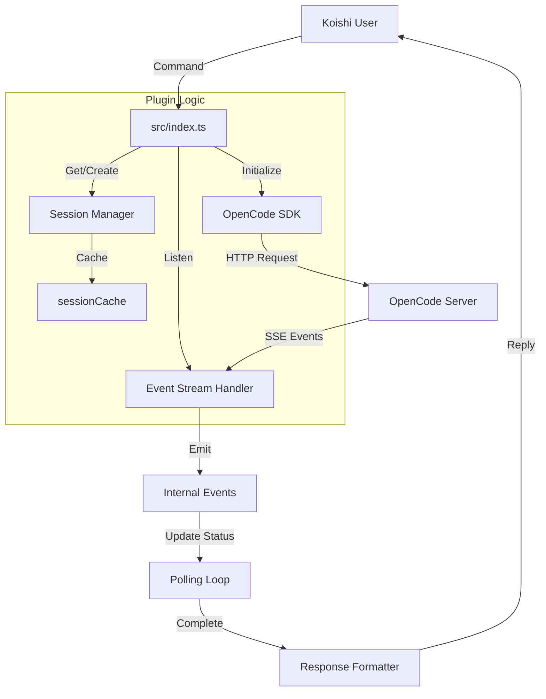

# 架构设计文档

本文档详细描述了 `src/index.ts` 的代码架构和设计逻辑。

## 核心架构 (Core Architecture)

`src/index.ts` 是 `koishi-plugin-opencode` 的核心入口文件，主要负责将 OpenCode SDK 的能力映射为 Koishi 的指令和事件系统。

### 1. 模块定义与配置

- **模块声明**: 扩展了 `koishi` 的 `Events` 接口，增加了 `opencode/error`, `opencode/activity`, `opencode/status` 等自定义事件，用于内部组件通信。
- **配置 Schema**: 定义了插件的配置项 `Config`，包括 `baseUrl` (服务器地址), `defaultSession`, `model`, `authority` 等，使用 `Schema.intersect` 组合了连接配置和权限配置。

### 2. 客户端初始化 (Client Initialization)

- **延迟/异步加载**: `initializeClients` 函数负责动态导入 `@opencode-ai/sdk` 并创建客户端实例。
- **双客户端模式**:
  - `main`: V1 客户端，用于主要的业务逻辑（会话、消息、模型）。
  - `health`: V2 客户端，专门用于健康检查接口 (`oc.health`)。
- **Promise 缓存**: `clientPromise` 缓存了初始化的 Promise，确保客户端只初始化一次。`ensureClient` 和 `ensureHealthClient` 辅助函数用于在指令执行时确保客户端已就绪。

### 3. 会话管理 (Session Management)

- **映射策略**: 通过 `getSessionId` 函数将 Koishi 的用户身份 (Platform + UserId) 映射为 OpenCode 的 Session ID。
- **本地缓存**: `sessionCache` (`Map<string, string>`) 用于缓存 Koishi 用户标识与 OpenCode Session ID 的对应关系，减少不必要的查找开销。
- **自动创建**: `getOrCreateSession` 尝试获取现有会话，如果不存在则自动创建一个以 "Koishi-" 开头的新会话。

### 4. 核心交互流程 (`oc` 指令)

主指令 `oc <message>` 的执行流程如下：

1.  **准备阶段**: 获取客户端实例，确定的 Session ID。
2.  **发送消息**: 调用 `client.session.prompt` 发送用户消息。
3.  **状态监听**:
    - 临时监听 `opencode/error`, `opencode/activity`, `opencode/status` 事件。
    - 使用 `lastActivity` 时间戳和 `currentStatus` 状态机来追踪生成进度。
4.  **轮询等待**:
    - 启动一个 `while` 循环轮询状态。
    - 检查超时 (`config.timeout`)。
    - 检查是否收到错误信号。
    - 检查是否进入 `idle` 状态且保持稳定（生成结束）。
5.  **结果获取**:
    - 即使流式生成结束，最终结果通过 `client.session.messages` 拉取完整的消息历史。
    - 过滤并提取最新的 Assistant 消息内容。
    - 格式化文本和代码块提示。

### 5. 事件流系统 (Event Stream)

- **事件订阅**: `setupEventStream` 函数通过 `client.event.subscribe()` 建立与 OpenCode Server 的 SSE/WebSocket 连接。
- **事件分发**:
  - `message.part.updated` / `message.updated`: 触发 `opencode/activity`，重置活跃计时器，防止超时。
  - `session.status`: 触发 `opencode/status`，更新当前的生成状态 (idle/busy)。
  - `session.error`: 触发 `opencode/error`，中断等待循环并报错。
- **生命周期**: 注册了 `ctx.on('dispose')`，确保插件卸载时断开事件流连接。

#### 日志格式化 (Log Formatting)

为了提供更好的调试体验，`formatPart` 函数实现了对不同 `Part` 类型的富文本格式化：

- **工具调用**:
  - `todowrite`: 渲染为带状态的 Markdown 任务列表 (`[ ]`, `[x]`, `[/]`)。
  - `edit` / `patch`: 渲染为带有文件名和 Diff 代码块的补丁预览。
- **子任务**: 显示子任务 Agent 名称及描述/提示。
- **SDK 类型对齐**: 严格遵循 [SDK Type Definitions](./docs/SDK_TYPES.md)，移除了不存在的属性访问 (如 `part.goal`, `part.reason`)。

### 6. 辅助指令集

- **模型管理**:
  - `oc.models`: 获取并过滤服务器支持的模型列表。
  - `oc.model.set`: 修改当前插件配置中的默认模型 (触发配置热重载)。
- **会话操作**:
  - `oc.session.list/new/set/delete/info`: 提供完整的会话 CRUD 操作，允许用户手动管理多会话。
  - `oc.session.messages`: 分页查看历史消息。
- **其他**:
  - `oc.health`: 检查服务器连通性。
  - `oc.agents`: 列出可用 Agent。

## 数据流向图

